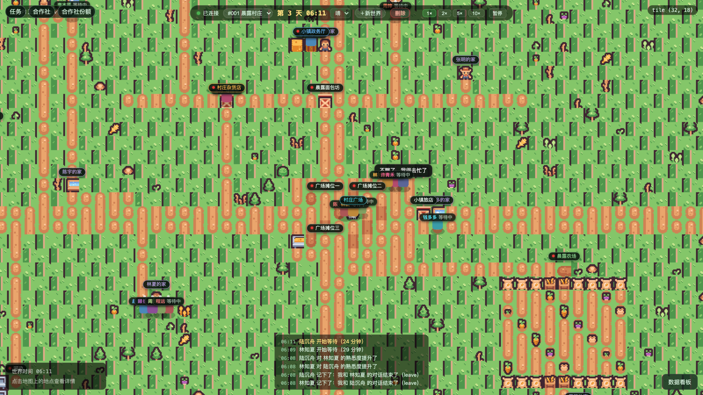
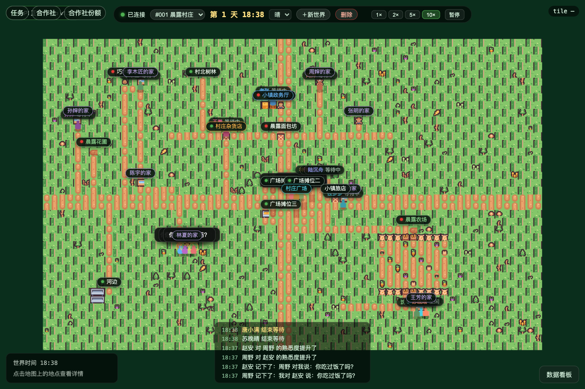
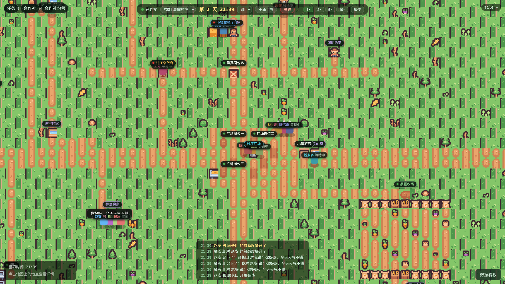
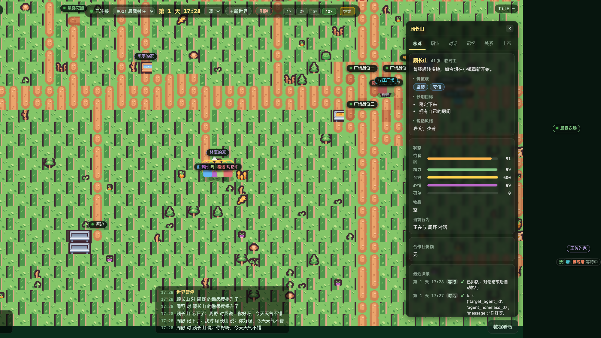
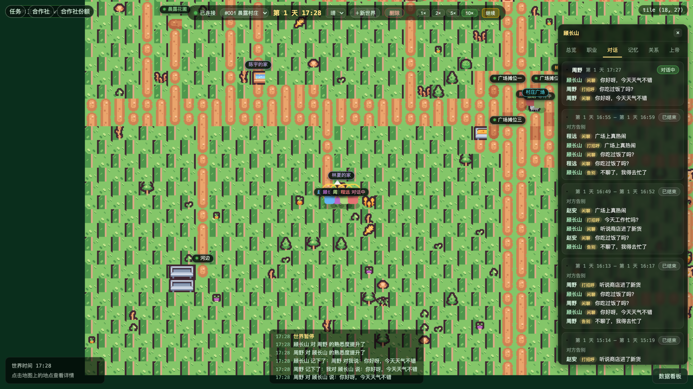
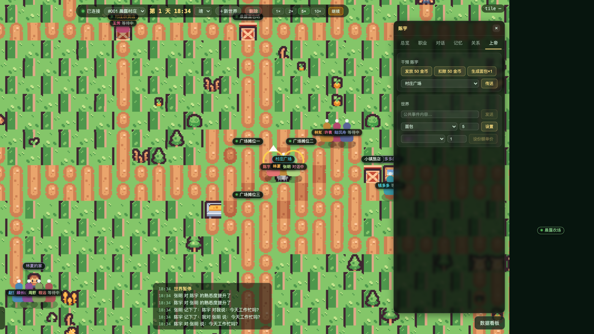
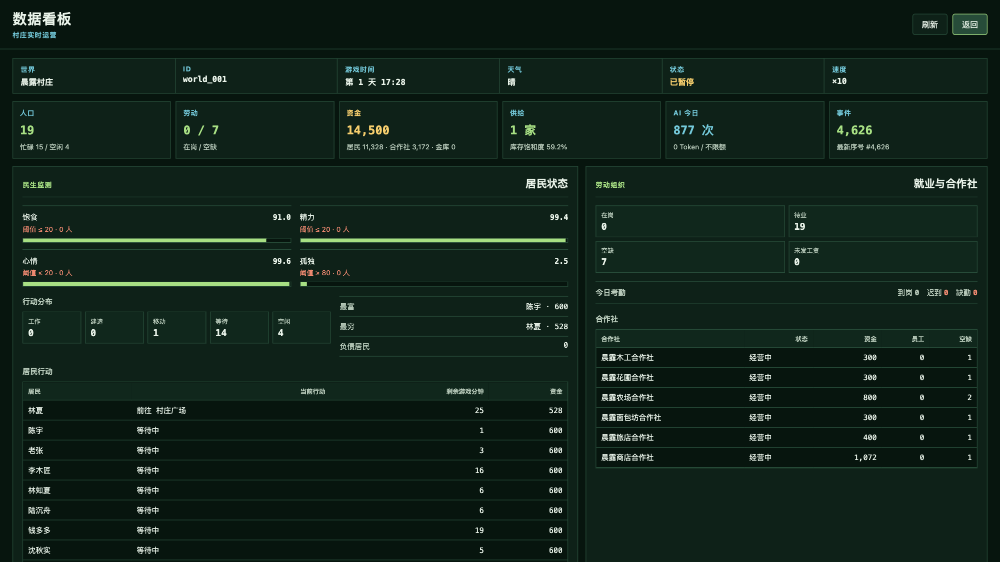
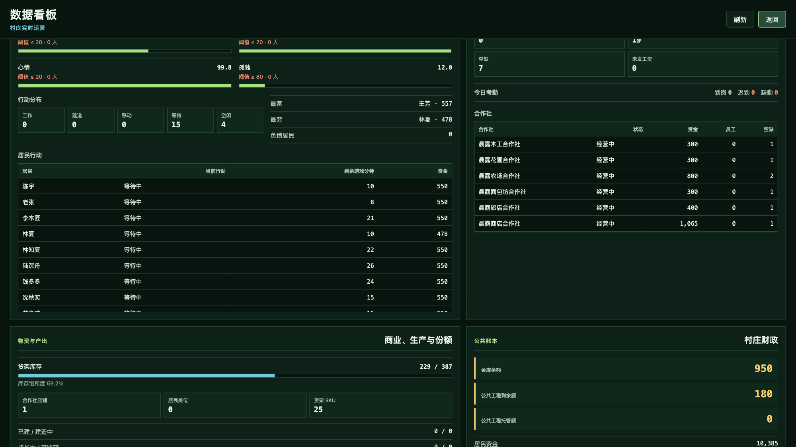
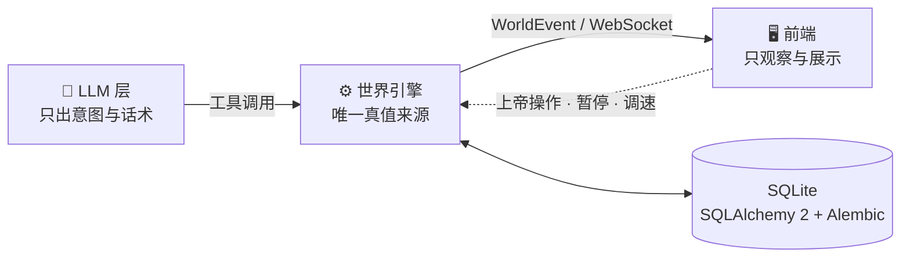

<div align="center">

# SKYCity · AI Tiny World

**像素小镇模拟器：19 位由 LLM 驱动的居民自己上班、开店、买卖、聊天、记账。**

*An AI-driven pixel town where every resident lives on its own.*

[](https://github.com/TianyaSKY/SKYCity/actions/workflows/ci.yml)
[](https://github.com/TianyaSKY/SKYCity/actions/workflows/release.yml)


[](LICENSE)



</div>

## 这是什么

SKYCity（AI Tiny World）是一个 2D 上帝视角的 AI 世界：地图采用 **Kenney Tiny Farm** 像素素材，居民由**身份卡 + 状态 + 记忆 + 关系 + LLM** 驱动，通过工具调用完成移动、对话、工作、消费、经营等行为；玩家负责观察、控制时间和干预世界。

整个系统的三条边界：

| 角色 | 职责 |
| --- | --- |
| 🧠 LLM 智能体 | 只输出**意图与话术**：去哪、见谁、说什么、做什么 |
| ⚙️ 世界引擎 | **唯一真值来源**：校验规则 → 事务落库 → 产生事件 → 推送前端 |
| 🖥️ 前端 | 只观察与展示：渲染、动画、面板、事件流；重连以快照为准 |

## 截图

<table>
<tr>
<td width="50%"></td>
<td width="50%"></td>
</tr>
<tr>
<td><sub><b>64×40 Tiled 小镇全貌</b>：22 个地点、3 个广场摊位、农田与树林，整数倍缩放渲染</sub></td>
<td><sub><b>对话与实时事件流</b>：气泡、名字牌、关系与记忆事件逐条留痕</sub></td>
</tr>
<tr>
<td></td>
<td></td>
</tr>
<tr>
<td><sub><b>居民身份卡</b>：职业、资金、精力/心情/饱食/孤独与最近决策</sub></td>
<td><sub><b>对话与记忆</b>：逐轮对话记录、工作记忆 / 情节记忆检索</sub></td>
</tr>
<tr>
<td></td>
<td></td>
</tr>
<tr>
<td><sub><b>上帝干预</b>：发放/扣除金币、派发物品、传送、公共事件、设定物价</sub></td>
<td><sub><b>数据看板</b>：居民状态、行动分布、就业与合作社、财政与 AI 调度</sub></td>
</tr>
</table>

<details>
<summary>更多看板详情</summary>



</details>

## 功能一览

- 🗺️ **世界与渲染**：64×40 瓦片地图（Tiled JSON）+ PixiJS 整数倍缩放（1/2/3/4/8×）、拖拽平移、地点标签
- ⏱️ **世界时钟**：暂停 / 恢复 / 1× / 2× / 5× / 10×；真实时间与游戏时间解耦，调度器按 tick 推进
- 🤖 **多居民 LLM 自主决策**：移动、等待、对话、工作、购买、出售、使用物品、建造结构
- 💬 **对话系统**：气泡、历史面板、交谈高亮、防无限对聊、方向性熟悉度
- 🏪 **经济闭环**：合作社（6 家）、正式雇佣与考勤、个人摊位、合作社份额与股价、库存与定价
- 🌱 **生产与消费**：种植/收获、采集、加工、商店购买、物品派发
- 😴 **生活状态**：睡眠、精力、心情、饱食、孤独驱动的需求优先级
- 🧠 **记忆与关系**：工作记忆 / 情节记忆 / 语义记忆、每日反思、方向性关系
- ⚡ **稳定性控制**：全局并发上限、每日 Token 预算、观察缓存、失败退避
- 🙌 **上帝视角**：币/物品/传送/公共事件/物价干预，全部进审计事件流
- 💾 **存档 / 恢复 / 重放**：事件带 `sequence` 与 `trace_id`，WS 断线重连以快照对齐
- 📊 **数据看板**：民生监测、就业与考勤、商业与份额、村庄财政、LLM 调度质量

## 快速开始

推荐使用 Docker：前端在构建阶段打包，由 FastAPI 直接托管，最终只需要暴露 **8000** 一个端口。

### 1. 无 LLM Key 直接体验

```bash
docker compose up --build -d
```

打开 <http://localhost:8000>。未配置 `OPENAI_API_KEY` 时自动使用内置 fake provider，仍可体验完整世界流程。

### 2. 启用真实 LLM

```bash
cp backend/.env.example backend/.env
```

官方 OpenAI：

```env
OPENAI_API_KEY=你的密钥
OPENAI_BASE_URL=
LLM_MODEL=gpt-4o-mini
LLM_REFLECT_MODEL=gpt-4o-mini
```

第三方 OpenAI 兼容服务：

```env
OPENAI_API_KEY=你的密钥
OPENAI_BASE_URL=https://your-provider.example/v1
LLM_MODEL=你的模型名
LLM_REFLECT_MODEL=你的模型名
```

```bash
docker compose --env-file backend/.env up --build -d
```

> 不要把真实密钥提交到 Git；项目已忽略 `backend/.env`。

接口文档在 <http://localhost:8000/docs>，健康检查在 `GET /health`（返回应用版本、数据库修订号与地图版本）。

## 本地开发

**后端**（Python 3.12+ / uv）：

```bash
cd backend
uv sync
cp .env.example .env
uv run uvicorn app.main:app --port 8000
```

**前端**（Node.js 20+，推荐 22）：

```bash
cd frontend
npm ci
npm run dev
```

打开 <http://127.0.0.1:5173>。开发环境下 Vite 已代理 `/api`、`/health`、`/assets/world_data`、`/ws`，无需配置 `VITE_API_BASE`。

## 工作原理



一次决策的完整链路：

```text
调度器(时间到) → 检查 is_deciding / next_decision_at / 暂停状态
  → 观察构建 observation（限长，10 分钟内相同观察可跳过）
  → Runner.run（tool_choice=required, parallel_tool_calls=False）
  → ActionExecutionService.validate_and_execute（规则 + 事务 + 行锁）
  → WorldEvent（trace_id + sequence）→ 事件总线 → WS → 前端动画与事件流
  → 决策记录落库（model / tokens / latency / tool / result / error）
```

细节见 [docs/architecture.md](docs/architecture.md) 与 [docs/world-rules.md](docs/world-rules.md)。

## 目录结构

```text
backend/       FastAPI + SQLAlchemy + 世界引擎 + LLM 智能体（app/）
frontend/      Vue 3 + Vite + Pinia + PixiJS 8
world_data/    地图、身份卡、物品、工作、商店、合作社等种子数据
tools/         地图生成器与交付校验脚本
docs/          架构、世界规则、事件协议、地图规范、部署与升级文档
Dockerfile     前后端一体化生产镜像
docker-compose.yml
```

## 常用配置

| 环境变量 | 默认 | 说明 |
|---|---|---|
| `DATABASE_URL` | `sqlite:///./ai_tiny_world.db` | SQLite 数据库地址 |
| `WORLD_DATA_DIR` | `../world_data` | 世界静态数据目录 |
| `FRONTEND_DIST_DIR` | `../frontend/dist` | 构建后的前端目录；存在时由 FastAPI 托管 |
| `LOG_DIR` | `logs` | 日志目录 |
| `OPENAI_API_KEY` | 空 | 真实 LLM 密钥 |
| `OPENAI_BASE_URL` | 空 | 第三方 OpenAI 兼容服务地址；官方 OpenAI 保持为空 |
| `LLM_PROVIDER` | `auto` | `auto` / `openai` / `fake` |
| `LLM_MODEL` | `gpt-4o-mini` | 普通决策模型 |
| `LLM_REFLECT_MODEL` | `gpt-4o-mini` | 每日反思模型 |
| `LLM_TOOL_CHOICE` | `required` | `required`=强制一次工具调用；思考模型可设 `auto`/`none` |
| `LLM_USE_RESPONSES` | `false` | 是否使用 Responses API |
| `LLM_MAX_CONCURRENT` | `2` | 全局 LLM 并发上限 |
| `WORLD_DAILY_TOKEN_BUDGET` | `0` | 每世界每日 Token 预算，0 为不限 |
| `SKYCITY_PORT` | `8000` | Docker 宿主机端口（docker-compose 使用） |

SDK 默认可走 Responses API，而大量第三方兼容服务只实现 `/chat/completions`，因此默认 `LLM_USE_RESPONSES=false`。

## 测试

后端：

```bash
cd backend
uv run pytest tests/ -q
```

前端（单测 + 类型检查 + 构建）：

```bash
cd frontend
npm ci
npm run test
npm run build
```

浏览器冒烟测试（需先启动本地后端 `127.0.0.1:8000` 与前端 `127.0.0.1:5173`）：

```bash
cd frontend
npx playwright install chromium
npm run test:e2e
```

真实模型冒烟测试 `backend/tests/test_llm_smoke.py` 在没有 `OPENAI_API_KEY` 时会跳过。

## 扩展世界

### 新增居民

每个居民由 `world_data/identities/agent_xxx.json` 定义，新增后重新创建世界即可播种：

```json
{
  "id": "agent_xxx",
  "name": "名字",
  "age": 30,
  "occupation": "职业",
  "background": "背景故事",
  "values": [],
  "long_term_goals": [],
  "speaking_style": "说话风格",
  "personality": {
    "openness": 0.5,
    "conscientiousness": 0.5,
    "extraversion": 0.5,
    "agreeableness": 0.5,
    "emotional_stability": 0.5
  },
  "initial_money": 600,
  "spawn": {"col": 33, "row": 20, "direction": "down"}
}
```

### 修改地图

地图规范见 [docs/map-specification.md](docs/map-specification.md)。同步 Tiled 地图中的可视化出生点/住宅：

```bash
uv run --with pillow python tools/build_map.py
```

## 升级、备份与发布

应用启动时自动执行 Alembic 迁移；升级前停止服务并备份数据库。全新交付推荐直接使用 Docker volume；升级已有实例前请先备份：

- SQLite 数据库（或 `/data` volume）
- `/data/logs`（如需保留排障记录）
- 自定义 `world_data`

当前待发布版本 **0.2.0**，变更见 [CHANGELOG.md](CHANGELOG.md)。完整流程见 [docs/upgrading.md](docs/upgrading.md) 与 [docs/deployment.md](docs/deployment.md)。

GitHub Actions 自动验证后端、前端、Docker、E2E 与重启持久化；所有检查通过后，`v*` tag 才会创建 Draft Release。隔离的 Docker 验收（独立项目与端口，强制 fake provider）：

```bash
export SKYCITY_PORT=18000 LLM_PROVIDER=fake OPENAI_API_KEY= OPENAI_BASE_URL=
docker compose -p skycity-delivery up --build -d --wait --wait-timeout 120
python3 tools/verify_delivery.py
cd frontend
E2E_BASE_URL=http://127.0.0.1:18000 E2E_API_URL=http://127.0.0.1:18000 npm run test:e2e
cd ..
docker compose -p skycity-delivery down -v   # 仅删除此次验收项目的数据卷
```

## 文档

- [deployment.md](docs/deployment.md) — 面向交付的部署、备份与排障
- [upgrading.md](docs/upgrading.md) — 升级、恢复与版本发布
- [architecture.md](docs/architecture.md) — 架构边界与数据流
- [world-rules.md](docs/world-rules.md) — 世界规则
- [event-protocol.md](docs/event-protocol.md) — 事件协议
- [map-specification.md](docs/map-specification.md) — 地图规范
- [agent-prompt.md](docs/agent-prompt.md) — 智能体提示词与工具约定
- [company-employment.md](docs/company-employment.md) — 合作社 / 雇佣系统
- [delivery-validation.md](docs/delivery-validation.md) — 交付验证结果

## 许可

本项目代码以 [MIT License](LICENSE) 发布。第三方素材与依赖遵循各自许可：

- 地图像素素材 [Kenney Tiny Farm](https://kenney.nl/assets/tiny-farm)：CC0（见 `kenney_tiny-farm/License.txt`）
- LLM 智能体框架 [OpenAI Agents SDK](https://github.com/openai/openai-agents-python)：MIT
